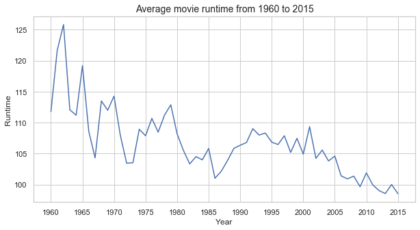
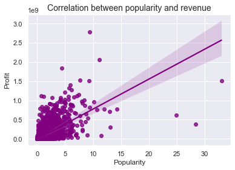

# Project: Investigate a Dataset (TMDb Movie Data)

## Table of Contents
<ul>
<li><a href="#intro">Introduction</a></li>
<li><a href="#wrangling">Data Wrangling</a></li>
<li><a href="#eda">Exploratory Data Analysis</a></li>
<li><a href="#conclusions">Conclusions</a></li>
</ul>

<a id='intro'></a>
## Introduction

**Selected Dataset**: TMDb Movie Data

**Data Description**: This dataset contains information about 10,000 movies collected from The Movie Database (TMDb), including user ratings and revenue.
<br>

- **`id `**: indicates the unique identifier of a movie
- **`imdb_id `**: indicates the unique identifier of a movie at The Movie Database
- **`popularity`**: indicates the popularity value of a movie
- **`budget`**: indicates the budget spent for a movie (likely to be in original currency)
- **`revenue`**: indicates the revenue earned by a movie (likely to be in original currency)
- **`original_title`**:  indicates the original title of a movie
- **`cast`**: indicates the cast of a movie
- **`homepage`**: indicates the homepage of a movie
- **`director`**: indicates the director of a movie
- **`tagline`**: indicates the tagline of a movie
- **`keywords`**: indicates the keywords of a movie
- **`overview`**: indicates the overview of a movie
- **`runtime`**: indicates the runtime of a movie
- **`genres`**: indicates the genre of a movie
- **`production_companies`**: indicates the production companies of a movie
- **`release_date`**: indicates the release date of a movie
- **`vote_count`**: indicates the vote count of a movie
- **`vote_average`**: indicates the vote average of a movie
- **`release_year`**: indicates the release year of a movie
- **`budget_adj`**: indicates the budget spent for a movie, adjusted for inflation
- **`revenue_adj`**: indicates the adjusted revenue of a movie, adjusted for inflation

Research Question 1 : Which year has the highest release of movies?

Research Question 2 : Which movie has the highest and lowest budget?
    
Research Question 3 : What is the average movie runtime from 1960 to 2015?
    
Research Question 4 : What is the correlation between popularity and revenue?


```python
import pandas as pd
import numpy as np
import seaborn as sns
import matplotlib.pyplot as plt
```

<a id='wrangling'></a>
## Data Wrangling

### General Properties


```python
df = pd.read_csv('tmdb-movies.csv')
df.head(3)
```


<div>
<style scoped>
    .dataframe tbody tr th:only-of-type {
        vertical-align: middle;
    }

    .dataframe tbody tr th {
        vertical-align: top;
    }

    .dataframe thead th {
        text-align: right;
    }
</style>
<table border="1" class="dataframe">
  <thead>
    <tr style="text-align: right;">
      <th></th>
      <th>id</th>
      <th>imdb_id</th>
      <th>popularity</th>
      <th>budget</th>
      <th>revenue</th>
      <th>original_title</th>
      <th>cast</th>
      <th>homepage</th>
      <th>director</th>
      <th>tagline</th>
      <th>...</th>
      <th>overview</th>
      <th>runtime</th>
      <th>genres</th>
      <th>production_companies</th>
      <th>release_date</th>
      <th>vote_count</th>
      <th>vote_average</th>
      <th>release_year</th>
      <th>budget_adj</th>
      <th>revenue_adj</th>
    </tr>
  </thead>
  <tbody>
    <tr>
      <th>0</th>
      <td>135397</td>
      <td>tt0369610</td>
      <td>32.985763</td>
      <td>150000000</td>
      <td>1513528810</td>
      <td>Jurassic World</td>
      <td>Chris Pratt|Bryce Dallas Howard|Irrfan Khan|Vi...</td>
      <td>http://www.jurassicworld.com/</td>
      <td>Colin Trevorrow</td>
      <td>The park is open.</td>
      <td>...</td>
      <td>Twenty-two years after the events of Jurassic ...</td>
      <td>124</td>
      <td>Action|Adventure|Science Fiction|Thriller</td>
      <td>Universal Studios|Amblin Entertainment|Legenda...</td>
      <td>6/9/15</td>
      <td>5562</td>
      <td>6.5</td>
      <td>2015</td>
      <td>1.379999e+08</td>
      <td>1.392446e+09</td>
    </tr>
    <tr>
      <th>1</th>
      <td>76341</td>
      <td>tt1392190</td>
      <td>28.419936</td>
      <td>150000000</td>
      <td>378436354</td>
      <td>Mad Max: Fury Road</td>
      <td>Tom Hardy|Charlize Theron|Hugh Keays-Byrne|Nic...</td>
      <td>http://www.madmaxmovie.com/</td>
      <td>George Miller</td>
      <td>What a Lovely Day.</td>
      <td>...</td>
      <td>An apocalyptic story set in the furthest reach...</td>
      <td>120</td>
      <td>Action|Adventure|Science Fiction|Thriller</td>
      <td>Village Roadshow Pictures|Kennedy Miller Produ...</td>
      <td>5/13/15</td>
      <td>6185</td>
      <td>7.1</td>
      <td>2015</td>
      <td>1.379999e+08</td>
      <td>3.481613e+08</td>
    </tr>
    <tr>
      <th>2</th>
      <td>262500</td>
      <td>tt2908446</td>
      <td>13.112507</td>
      <td>110000000</td>
      <td>295238201</td>
      <td>Insurgent</td>
      <td>Shailene Woodley|Theo James|Kate Winslet|Ansel...</td>
      <td>http://www.thedivergentseries.movie/#insurgent</td>
      <td>Robert Schwentke</td>
      <td>One Choice Can Destroy You</td>
      <td>...</td>
      <td>Beatrice Prior must confront her inner demons ...</td>
      <td>119</td>
      <td>Adventure|Science Fiction|Thriller</td>
      <td>Summit Entertainment|Mandeville Films|Red Wago...</td>
      <td>3/18/15</td>
      <td>2480</td>
      <td>6.3</td>
      <td>2015</td>
      <td>1.012000e+08</td>
      <td>2.716190e+08</td>
    </tr>
  </tbody>
</table>
<p>3 rows × 21 columns</p>
</div>


```python
df.tail(3)
```


<div>
<style scoped>
    .dataframe tbody tr th:only-of-type {
        vertical-align: middle;
    }

    .dataframe tbody tr th {
        vertical-align: top;
    }

    .dataframe thead th {
        text-align: right;
    }
</style>
<table border="1" class="dataframe">
  <thead>
    <tr style="text-align: right;">
      <th></th>
      <th>id</th>
      <th>imdb_id</th>
      <th>popularity</th>
      <th>budget</th>
      <th>revenue</th>
      <th>original_title</th>
      <th>cast</th>
      <th>homepage</th>
      <th>director</th>
      <th>tagline</th>
      <th>...</th>
      <th>overview</th>
      <th>runtime</th>
      <th>genres</th>
      <th>production_companies</th>
      <th>release_date</th>
      <th>vote_count</th>
      <th>vote_average</th>
      <th>release_year</th>
      <th>budget_adj</th>
      <th>revenue_adj</th>
    </tr>
  </thead>
  <tbody>
    <tr>
      <th>10863</th>
      <td>39768</td>
      <td>tt0060161</td>
      <td>0.065141</td>
      <td>0</td>
      <td>0</td>
      <td>Beregis Avtomobilya</td>
      <td>Innokentiy Smoktunovskiy|Oleg Efremov|Georgi Z...</td>
      <td>NaN</td>
      <td>Eldar Ryazanov</td>
      <td>NaN</td>
      <td>...</td>
      <td>An insurance agent who moonlights as a carthie...</td>
      <td>94</td>
      <td>Mystery|Comedy</td>
      <td>Mosfilm</td>
      <td>1/1/66</td>
      <td>11</td>
      <td>6.5</td>
      <td>1966</td>
      <td>0.000000</td>
      <td>0.0</td>
    </tr>
    <tr>
      <th>10864</th>
      <td>21449</td>
      <td>tt0061177</td>
      <td>0.064317</td>
      <td>0</td>
      <td>0</td>
      <td>What's Up, Tiger Lily?</td>
      <td>Tatsuya Mihashi|Akiko Wakabayashi|Mie Hama|Joh...</td>
      <td>NaN</td>
      <td>Woody Allen</td>
      <td>WOODY ALLEN STRIKES BACK!</td>
      <td>...</td>
      <td>In comic Woody Allen's film debut, he took the...</td>
      <td>80</td>
      <td>Action|Comedy</td>
      <td>Benedict Pictures Corp.</td>
      <td>11/2/66</td>
      <td>22</td>
      <td>5.4</td>
      <td>1966</td>
      <td>0.000000</td>
      <td>0.0</td>
    </tr>
    <tr>
      <th>10865</th>
      <td>22293</td>
      <td>tt0060666</td>
      <td>0.035919</td>
      <td>19000</td>
      <td>0</td>
      <td>Manos: The Hands of Fate</td>
      <td>Harold P. Warren|Tom Neyman|John Reynolds|Dian...</td>
      <td>NaN</td>
      <td>Harold P. Warren</td>
      <td>It's Shocking! It's Beyond Your Imagination!</td>
      <td>...</td>
      <td>A family gets lost on the road and stumbles up...</td>
      <td>74</td>
      <td>Horror</td>
      <td>Norm-Iris</td>
      <td>11/15/66</td>
      <td>15</td>
      <td>1.5</td>
      <td>1966</td>
      <td>127642.279154</td>
      <td>0.0</td>
    </tr>
  </tbody>
</table>
<p>3 rows × 21 columns</p>
</div>


```python
df.shape
```


    (10866, 21)


```python
df.dtypes
```


    id                        int64
    imdb_id                  object
    popularity              float64
    budget                    int64
    revenue                   int64
    original_title           object
    cast                     object
    homepage                 object
    director                 object
    tagline                  object
    keywords                 object
    overview                 object
    runtime                   int64
    genres                   object
    production_companies     object
    release_date             object
    vote_count                int64
    vote_average            float64
    release_year              int64
    budget_adj              float64
    revenue_adj             float64
    dtype: object


```python
df['release_date'] = pd.to_datetime(df['release_date'])
```


```python
df.dtypes
```


    id                               int64
    imdb_id                         object
    popularity                     float64
    budget                           int64
    revenue                          int64
    original_title                  object
    cast                            object
    homepage                        object
    director                        object
    tagline                         object
    keywords                        object
    overview                        object
    runtime                          int64
    genres                          object
    production_companies            object
    release_date            datetime64[ns]
    vote_count                       int64
    vote_average                   float64
    release_year                     int64
    budget_adj                     float64
    revenue_adj                    float64
    dtype: object


```python
df.info()
```

    <class 'pandas.core.frame.DataFrame'>
    RangeIndex: 10866 entries, 0 to 10865
    Data columns (total 21 columns):
     #   Column                Non-Null Count  Dtype         
    ---  ------                --------------  -----         
     0   id                    10866 non-null  int64         
     1   imdb_id               10856 non-null  object        
     2   popularity            10866 non-null  float64       
     3   budget                10866 non-null  int64         
     4   revenue               10866 non-null  int64         
     5   original_title        10866 non-null  object        
     6   cast                  10790 non-null  object        
     7   homepage              2936 non-null   object        
     8   director              10822 non-null  object        
     9   tagline               8042 non-null   object        
     10  keywords              9373 non-null   object        
     11  overview              10862 non-null  object        
     12  runtime               10866 non-null  int64         
     13  genres                10843 non-null  object        
     14  production_companies  9836 non-null   object        
     15  release_date          10866 non-null  datetime64[ns]
     16  vote_count            10866 non-null  int64         
     17  vote_average          10866 non-null  float64       
     18  release_year          10866 non-null  int64         
     19  budget_adj            10866 non-null  float64       
     20  revenue_adj           10866 non-null  float64       
    dtypes: datetime64[ns](1), float64(4), int64(6), object(10)
    memory usage: 1.7+ MB
    

### Data Cleaning (Removing The Unused Information From The Dataset)
> #### Information That We Need To Delete Or Modify
1. Dropping unused columns
2. Dropping duplicated rows
3. Updating datetime format of release date
4. Dropping columns with null values

**1. Dropping unused columns**
> Certain column(s) are unusable and therefore should be dropped.
> These columns include imdb_id, homepage, tagline, overview, cast, director, budget_adj and revenue_adj.


```python
df.drop(['imdb_id','homepage','tagline','overview','cast','director','budget_adj','revenue_adj'],axis =1,inplace = True)
```


```python
df.shape
```


    (10866, 13)


```python
df.dtypes
```


    id                               int64
    popularity                     float64
    budget                           int64
    revenue                          int64
    original_title                  object
    keywords                        object
    runtime                          int64
    genres                          object
    production_companies            object
    release_date            datetime64[ns]
    vote_count                       int64
    vote_average                   float64
    release_year                     int64
    dtype: object


**2. Dropping duplicated rows**
> Certain row(s) are duplicated and therefore should be dropped.


```python
sum(df.duplicated())
```


    1


```python
df.drop_duplicates(inplace = True)
```


```python
df.shape
```


    (10865, 13)


**3. Updating datetime format of release date**
> release_date is in object type and should be updated to datetime format, refer to cells 7 and 8 for details.

**4. Dropping columns with null values**
> For the purposes of analysis, it is better to drop columns with null values.


```python
df.dropna(how = 'any',inplace = True)
```


```python
df.shape
```


    (8701, 13)


##### Since now we have the columns, rows and format of the dataset in right way, its time to investigate the data for the questions asked. 

<a id='eda'></a>
## Exploratory Data Analysis

### Research Question 1 : Which year has the highest release of movies?


```python
df['release_year'].value_counts()[0:100]
```


    2014    525
    2013    457
    2015    444
    2009    414
    2012    389
    2011    386
    2008    382
    2007    351
    2010    343
    2006    327
    2005    300
    2004    237
    2002    221
    2003    214
    1999    198
    2001    196
    2000    185
    1996    182
    1998    181
    1997    174
    1993    166
    1994    164
    1995    159
    1990    123
    1992    121
    1988    120
    1989    119
    1991    111
    1986    104
    1987    104
    1984     97
    1985     96
    1982     78
    1981     74
    1983     74
    1980     72
    1978     59
    1973     55
    1979     54
    1971     54
    1977     54
    1966     44
    1976     44
    1974     43
    1964     41
    1975     40
    1970     38
    1968     36
    1967     36
    1972     36
    1963     33
    1965     33
    1962     30
    1960     30
    1961     28
    1969     25
    Name: release_year, dtype: int64


> **It is concluded that year 2014 has the highest release of movies (525).**


```python
### Research Question 2 : Which movie has the highest and lowest budget?
```


```python
def return_highestlowest(x):
    min_index = df[x].idxmin()
    high_index = df[x].idxmax()
    high = pd.DataFrame(df.loc[high_index,:])
    low = pd.DataFrame(df.loc[min_index,:])
    
    print("Which movie has the highest "+ x + " : ",df['original_title'][high_index])
    print("Which movie has the lowest "+ x + "  : ",df['original_title'][min_index])
    return pd.concat([high,low],axis = 1)

return_highestlowest('budget')
```

    Which movie has the highest budget :  The Warrior's Way
    Which movie has the lowest budget  :  Mr. Holmes
    


<div>
<style scoped>
    .dataframe tbody tr th:only-of-type {
        vertical-align: middle;
    }

    .dataframe tbody tr th {
        vertical-align: top;
    }

    .dataframe thead th {
        text-align: right;
    }
</style>
<table border="1" class="dataframe">
  <thead>
    <tr style="text-align: right;">
      <th></th>
      <th>2244</th>
      <th>30</th>
    </tr>
  </thead>
  <tbody>
    <tr>
      <th>id</th>
      <td>46528</td>
      <td>280996</td>
    </tr>
    <tr>
      <th>popularity</th>
      <td>0.25054</td>
      <td>3.92733</td>
    </tr>
    <tr>
      <th>budget</th>
      <td>425000000</td>
      <td>0</td>
    </tr>
    <tr>
      <th>revenue</th>
      <td>11087569</td>
      <td>29355203</td>
    </tr>
    <tr>
      <th>original_title</th>
      <td>The Warrior's Way</td>
      <td>Mr. Holmes</td>
    </tr>
    <tr>
      <th>keywords</th>
      <td>assassin|small town|revenge|deception|super speed</td>
      <td>london|detective|sherlock holmes</td>
    </tr>
    <tr>
      <th>runtime</th>
      <td>100</td>
      <td>103</td>
    </tr>
    <tr>
      <th>genres</th>
      <td>Adventure|Fantasy|Action|Western|Thriller</td>
      <td>Mystery|Drama</td>
    </tr>
    <tr>
      <th>production_companies</th>
      <td>Boram Entertainment Inc.</td>
      <td>BBC Films|See-Saw Films|FilmNation Entertainme...</td>
    </tr>
    <tr>
      <th>release_date</th>
      <td>2010-12-02 00:00:00</td>
      <td>2015-06-19 00:00:00</td>
    </tr>
    <tr>
      <th>vote_count</th>
      <td>74</td>
      <td>425</td>
    </tr>
    <tr>
      <th>vote_average</th>
      <td>6.4</td>
      <td>6.4</td>
    </tr>
    <tr>
      <th>release_year</th>
      <td>2010</td>
      <td>2015</td>
    </tr>
  </tbody>
</table>
</div>


> **It is concluded that The Warrior's Way has the highest budget, whereas Mr. Holmes has the lowest budget.**

### Research Question 3 : What is the average movie runtime from 1960 to 2015?


```python
df.groupby('release_year').mean()['runtime'].plot(xticks = np.arange(1960,2016,5))

sns.set(rc={'figure.figsize':(10,5)})

plt.title("Average movie runtime from 1960 to 2015",fontsize = 14)

plt.xlabel('Year',fontsize = 12)
plt.ylabel('Runtime',fontsize = 12)
sns.set_style("whitegrid")
```





> **From the line graph, it is concluded that the average movie runtime shows a decreasing trend from 1960 to 2015.**

### Research Question 4 : What is the correlation between popularity and revenue?


```python
ax = sns.regplot(x=df['popularity'],y=df['revenue'],color='purple')

ax.set_title("Correlation between popularity and revenue",fontsize=14)
ax.set_xlabel("Popularity",fontsize=12)
ax.set_ylabel("Profit",fontsize=12)

sns.set(rc={'figure.figsize':(4,6)})


def correlation_coeff(x,y):
    std_x=(x-x.mean())/x.std(ddof=0)
    std_y=(y-y.mean())/y.std(ddof=0)
    return(std_x*std_y).mean()

correlation_coeff(df['popularity'],df['revenue'])
```


    0.6593688704814512





> **From the scatter plot, it is concluded that there is a positive relationship between popularity and revenue with a correlation coefficient of 0.66.**

Conclusions
The TMDb dataset provides many information of movies from 1960 to 2015. After dropping unused columns, dropping duplicated rows, updating datetime format of release date and dropping columns with null values, we conclude that:

- Year 2014 has the highest release of movies (525);
- The Warrior's Way has the highest budget, whereas Mr. Holmes has the lowest budget;
- The average movie runtime shows a decreasing trend from 1960 to 2015 and
- There is a positive relationship between popularity and revenue with a correlation coefficient of 0.66.

Note that even though we manage to analyse the above TMDb movie dataset, there are slight concerns regarding the data quality from the data sources, which may affect the overall analysis results.


